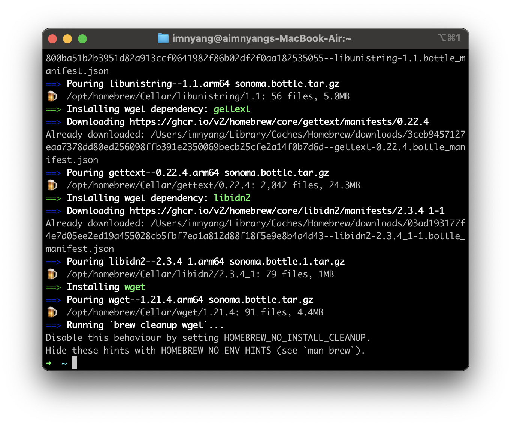

Mac에서 프로그램을 직접 찾아서 설치하기 끔찍하죠

터미널에서 프로그램이 없어서 인터넷에서 찾아서 설치하고... 그러다가 환경변수 등록하고 이런거 매우 귀찮습니다!

    💡 Linux에서도 작동합니다.

## 설치

```zsh
/bin/bash -c "$(curl -fsSL https://raw.githubusercontent.com/Homebrew/install/HEAD/install.sh)"
```

설치 끝!

## 예시

```zsh
brew install wget
```

