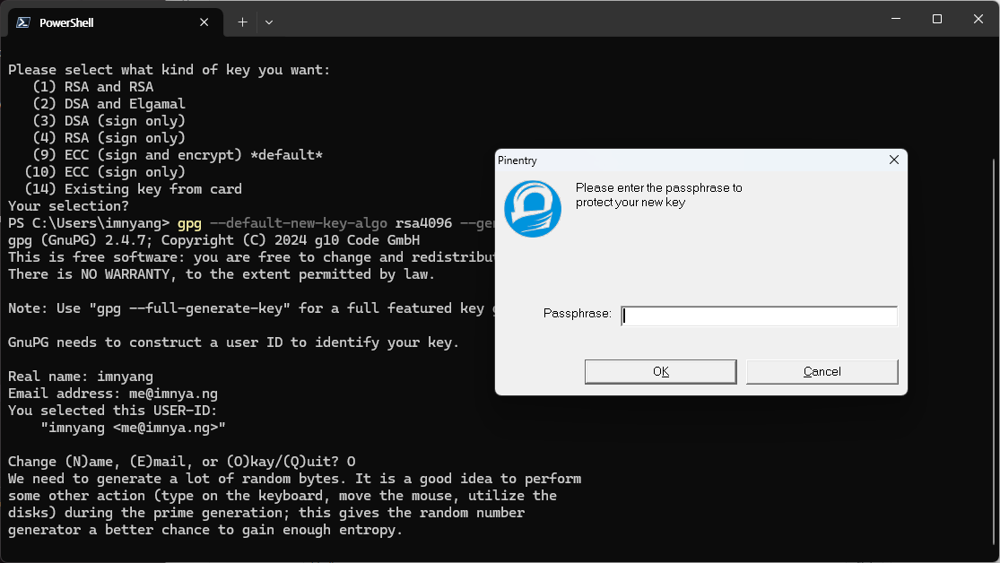
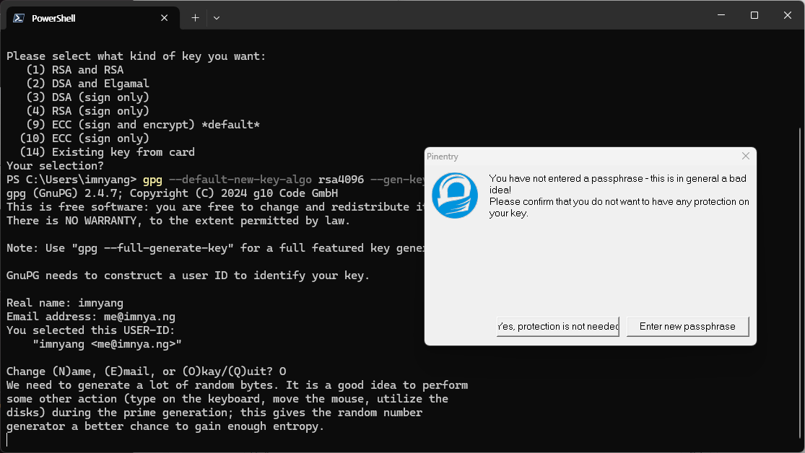
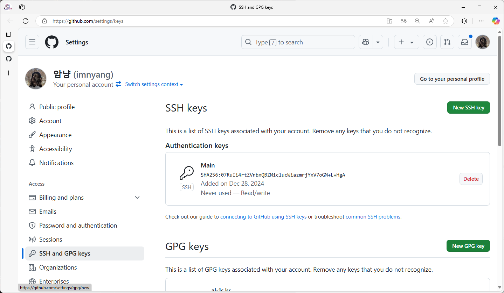
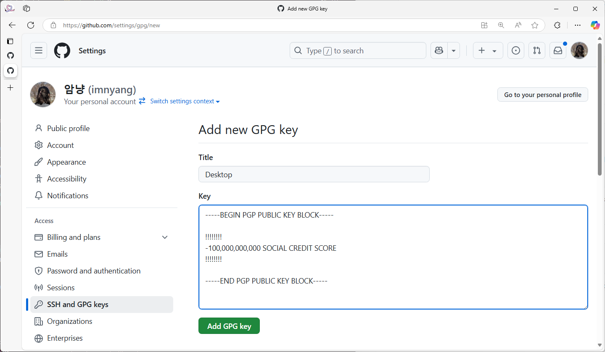
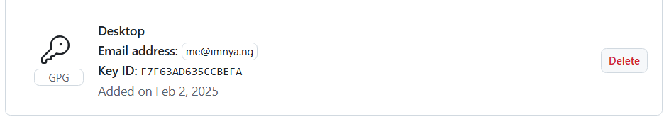
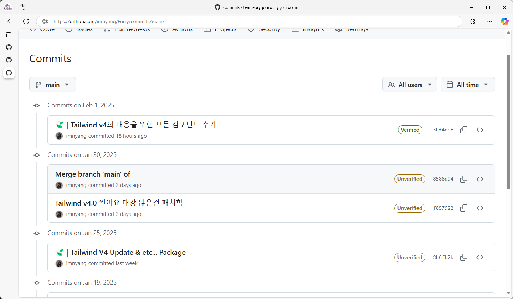

Github에서 Verified Commit을 설정해보자!

Github에선 Local에 있는 GPG Key를 이용해 Verified Commit을 할 수 있다.


Github에선 이와 같이 커밋의 대한 인증 상태를 보여주고 있는데 Github에 말에 따르면 다른 사람들에게 변경 사항의 출처에 대한 확?신을 줄 수 있다고 한다.

## 0. GPG 설치하기

대부분의 Linux 배포판과 MacOS에서는 GPG가 기본으로 내장되어 있지만 우리의 멋진 Windows는 기본적으로 지원하지 않는다.

Windows 10 이상에서는 Winget을 통해 설치할 수 있으니 아래의 명령어를 사용해 설치하자.

```pwsh
winget install -e --id GnuPG.GnuPG
```
```pwsh
찾음 GNU Privacy Guard [GnuPG.GnuPG] 버전 2.4.7
이 응용 프로그램의 라이선스는 그 소유자가 사용자에게 부여했습니다.
Microsoft는 타사 패키지에 대한 책임을 지지 않고 라이선스를 부여하지도 않습니다.
다운로드 중 https://gnupg.org/ftp/gcrypt/binary/gnupg-w32-2.4.7_20241125.exe
  ██████████████████████████████  5.36 MB / 5.36 MB
설치 관리자 해시를 확인했습니다.
패키지 설치를 시작하는 중...
설치 관리자가 관리자 권한으로 실행을 요청합니다. 프롬프트가 필요합니다.
설치 성공
```

아니면 이 링크에서 Gpg4win을 다운로드 받아서 설치할 수도 있다.
https://www.gnupg.org/download/

## 1. GPG Key 생성하기

GPG Key를 생성을 해야하는데 Github에선 RSA-4096을 권장한다.

```bash
gpg --default-new-key-algo rsa4096 --gen-key
```
```bash
gpg (GnuPG) 2.4.7; Copyright (C) 2024 g10 Code GmbH
This is free software: you are free to change and redistribute it.
There is NO WARRANTY, to the extent permitted by law.

Note: Use "gpg --full-generate-key" for a full featured key generation dialog.

GnuPG needs to construct a user ID to identify your key.

Real name:
```

여기서 이름을 요구하는데 Github에 등록된 이름과 이메일을 입력하면 된다.

```bash
Real name: imnyang
Email address: me@imnya.ng
You selected this USER-ID:
    "imnyang <me@imnya.ng>"

Change (N)ame, (E)mail, or (O)kay/(Q)uit? O
```

이후에는 TUI를 통해 암호를 입력하라고 하는데 이 암호는 커밋을 할 때마다 입력해야 하는 암호이다.

입력하지 않아도 ~~무관하다~~보안상 무관하지 않다. 윈도우는 아래와 같이 GUI로 입력하게 된다.




```
We need to generate a lot of random bytes. It is a good idea to perform
some other action (type on the keyboard, move the mouse, utilize the
disks) during the prime generation; this gives the random number
generator a better chance to gain enough entropy.
gpg: C:\\Users\\imnyang\\AppData\\Roaming\\gnupg\\trustdb.gpg: trustdb created
gpg: directory 'C:\\Users\\imnyang\\AppData\\Roaming\\gnupg\\openpgp-revocs.d' created
gpg: revocation certificate stored as 'C:\\Users\\imnyang\\AppData\\Roaming\\gnupg\\openpgp-revocs.d\\2C9159B5C18C812F0E0C9783F7F63AD635CCBEFA.rev'
public and secret key created and signed.

Note that this key cannot be used for encryption.  You may want to use
the command "--edit-key" to generate a subkey for this purpose.
pub   rsa4096 2025-02-02 [SC] [expires: 2028-11-08]
      MIMUKAWANICETRY@YOUCANTUSETHISKEYFORCRYPTOGRAPHY
uid                      imnyang <me@imnya.ng>
```

아마 넘어가지지 않는다면 키보드를 눌러서 랜덤 바이트를 생성하게 하게 하면 된다.

그러면 위와 같이 현재 날짜로부터 3년 뒤까지 유효한 키가 생성된다.

## 2. GPG Key 확인하기

이제 생성된 GPG Key를 확인해야 하는데 이는 아래와 같은 명령어로 확인할 수 있다.

```bash
gpg --list-secret-keys --keyid-format LONG
```

```bash
gpg: checking the trustdb
gpg: marginals needed: 3  completes needed: 1  trust model: pgp
gpg: depth: 0  valid:   1  signed:   0  trust: 0-, 0q, 0n, 0m, 0f, 1u
gpg: next trustdb check due at 2028-02-02
[keyboxd]
---------
sec   rsa4096/THISFORCRYTOGRAPHY 2025-02-02 [SC] [expires: 2028-02-02]
      MIMUKAWANICETRY@PRIVKEY
uid                 [ultimate] imnyang <me@imnya.ng>
```

여기서 `sec rsa4096/` 뒤에 있는 Key ID 부분이나 `MIMUKAWANICETRY@PRIVKEY` 부분을 복사하면 된다.

이중 Key ID 부분을 복사하는 것을 추천한다.

## 3. GPG Key의 공개키를 확인하기

이제 공개키를 확인해야 하는데 이는 아래와 같은 명령어로 확인할 수 있다.

```bash
gpg --armor --export 위에서 복사한 부분
```

```bash
-----BEGIN PGP PUBLIC KEY BLOCK-----

!!!!!!!!
-100,000,000,000 SOCIAL CREDIT SCORE
!!!!!!!!

-----END PGP PUBLIC KEY BLOCK-----
```

이렇게 나오는데 이를 복사해서 Github에 등록하면 된다.

## 4. Github에 GPG Key 등록하기

Github에 들어가서 [Settings -> SSH and GPG keys ->](https://github.com/settings/keys) [New GPG key](https://github.com/settings/gpg/new)를 눌러서 등록하면 된다.




이렇게 등록하면 된다.

## 5. Git에서 GPG Key를 사용하게 설정하기

이제 Git에서 GPG Key를 사용하게 설정해야 하는데 이는 아래와 같은 명령어로 설정할 수 있다.

```bash
git config --global commit.gpgsign true
```

이제 Verified Commit을 할 수 있게 된다.



## 6. Verified Commit 확인하기

이제 Verified Commit을 확인해야 하는데 이는 아래와 같은 명령어로 확인할 수 있다.

```bash
git log --show-signature
```

혹은 Github에서 확인할 수 있다.



만약 Github에서 Verified Commit이 되지 않았다면 아래와 같은 명령어로 확인할 수 있다.

제대로 등록이 안되었을 수도 있으니 위와 같은 과정을 다시 확인해야한다.

