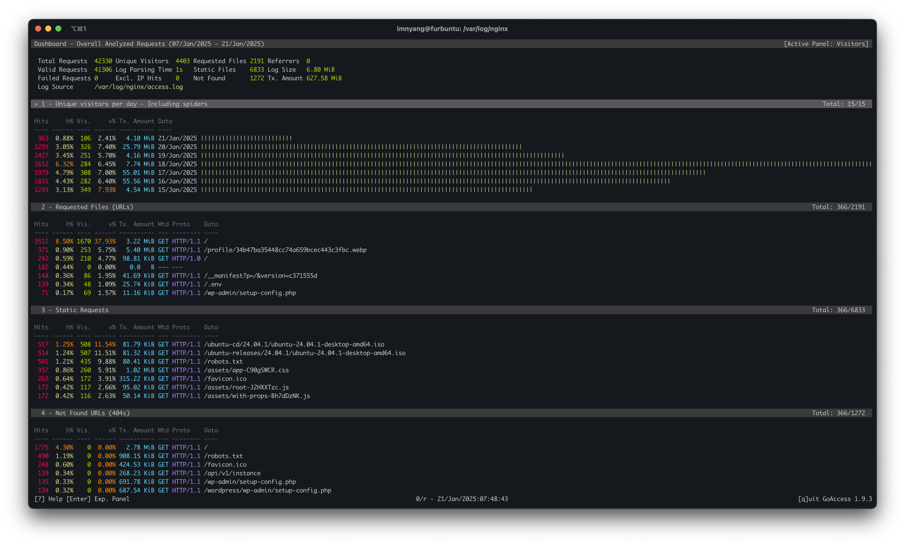
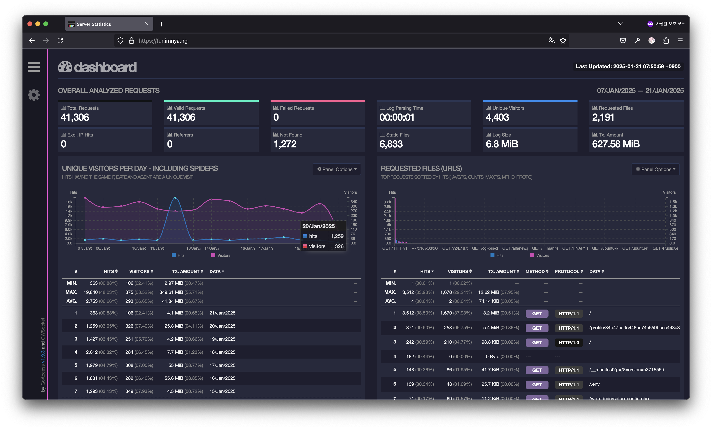

Nginx 로그를 분석할 떄 저는 GoAccess를 사용합니다.

GoAccess로 주기적으로 로그를 분석을 생성해봅시다.

## GoAccess 설치

Ubuntu / Debian은 다음과 같습니다.
```bash
wget -O - https://deb.goaccess.io/gnugpg.key | gpg --dearmor | sudo tee /usr/share/keyrings/goaccess.gpg >/dev/null
echo "deb [signed-by=/usr/share/keyrings/goaccess.gpg arch=$(dpkg --print-architecture)] https://deb.goaccess.io/ $(lsb_release -cs) main" | sudo tee /etc/apt/sources.list.d/goaccess.list
sudo apt update
sudo apt install goaccess
```

Fedora는 이미 저장소가 추가되어 있습니다.
```bash
sudo dnf install goaccess
```

Arch Linux 또한 저장소가 추가되어 있습니다.
```bash
sudo pacman -S goaccess
```

## GoAccess 사용법

GoAccess를 사용하기 위해서는 Nginx 로그가 필요합니다. Nginx 로그는 `/var/log/nginx`에 위치해 있습니다.

사용자에 Nginx 설정에 따라 다를 수 있습니다.

간단하게 터미널에서 보려면 아래와 같은 명령어를 입력하면 됩니다.
```bash
goaccess /var/log/nginx/access.log -c
```



또한 GoAccess를 웹에서 보려면 아래와 같은 명령어를 입력하면 됩니다.
```bash
goaccess /var/log/nginx/access.log -o /var/www/html/report.html --log-format=COMBINED
```



이렇게 하면 `/var/www/html/report.html`에 로그 분석 결과가 저장됩니다.

### GoAccess 자동화
Cron을 사용하여 GoAccess의 결과를 주기적으로 생성할 수 있습니다.

`crontab -e` 명령어를 입력하여 아래와 같이 설정을 추가합니다.
```bash
0 0 * * * goaccess /var/log/nginx/access.log -o /var/static/goaccess.imnya.ng/index.html --log-format=COMBINED
```
위와 같이 설정하면 매일 0시 0분에 GoAccess 결과가 생성됩니다.

<Aside>
Cron이 작동하지 않는다고요? 아래와 같은 명령어를 입력하여 Cron을 활성화합니다.
```bash
imnyang@furbuntu:~$ sudo systemctl enable --now cron
Synchronizing state of cron.service with SysV service script with /usr/lib/systemd/systemd-sysv-install.
Executing: /usr/lib/systemd/systemd-sysv-install enable cron
```
</Aside>

## Nginx 로그 분할 끄기

필수는 아니지만 저는 로그가 나뉘어서 나오는 것이 싫어서 로그를 하나로 합치는 작업도 진행하였습니다.

이 로그를 나누는덴 Logrotate가 사용되고 있습니다. Logrotate는 로그 파일을 일정 주기로 나누어서 관리하는 프로그램입니다. 이를 사용하지 않으려면 Logrotate 설정을 아래와 같이 수정하면 됩니다.

```conf
#/var/log/nginx/*.log {
#       daily
#       missingok
#       rotate 14
#       compress
#       delaycompress
#       notifempty
#       create 0640 www-data adm
#       sharedscripts
#       prerotate
#               if [ -d /etc/logrotate.d/httpd-prerotate ]; then \
#                       run-parts /etc/logrotate.d/httpd-prerotate; \
#               fi \
#       endscript
#       postrotate
#               invoke-rc.d nginx rotate >/dev/null 2>&1
#       endscript
#
#}
/var/log/nginx/*.log {
    rotate 0
    compress
    notifempty
    missingok
    create 0640 www-data adm
}
```

설정을 적용하기 위해 아래와 같은 명령어를 입력합니다.

`sudo systemctl restart logrotate`

위와 같이 설정을 변경하면 로그가 나뉘어서 나오지 않습니다.

또한 나뉜 로그를 합치기 위해 아래와 같은 스크립트를 실행하면 됩니다.
```bash
#!/bin/bash

LOG_DIR="/var/log/nginx" # Nginx 로그가 있는 디렉토리로 변경하여주세요.
ACCESS_OUTPUT="combined_access.log"
ERROR_OUTPUT="combined_error.log"

cd "$LOG_DIR" || exit 1

# access.log 병합
zcat -f access.log* | sort -V > "$ACCESS_OUTPUT"
echo "Access 로그가 $ACCESS_OUTPUT 파일에 병합되었습니다."

# error.log 병합
zcat -f error.log* | sort -V > "$ERROR_OUTPUT"
echo "Error 로그가 $ERROR_OUTPUT 파일에 병합되었습니다."

mv access.log error.log access.log* access.log*.gz error.log* error.log*.gz /tmp
echo "기존 로그 파일이 /tmp 디렉토리로 이동되었습니다."

mv combined_access.log access.log
mv combined_error.log error.log
echo "병합된 로그 파일이 원래 위치로 이동되었습니다."
```

위와 같은 스크립트를 실행하면 로그가 합쳐집니다.
