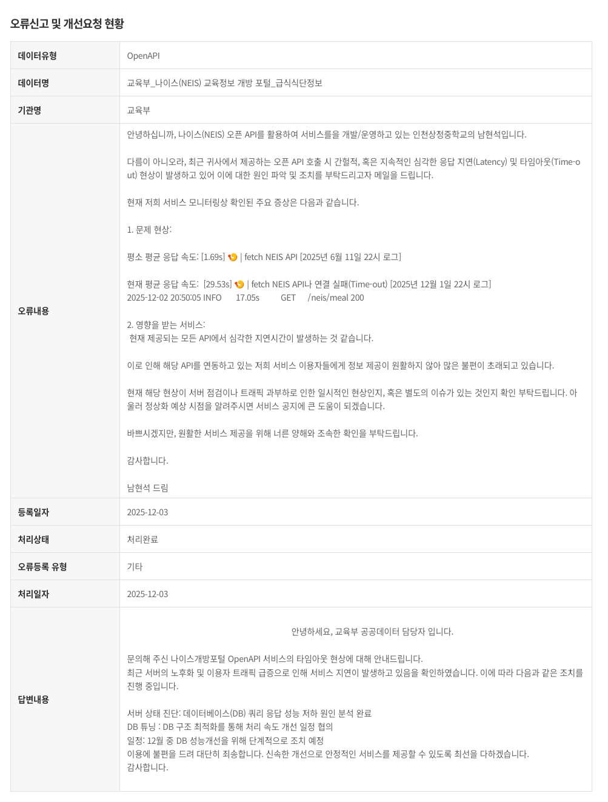

## 들어가며

NYL은 학생들의 시간표와 급식을 간편하게 확인하기 위해 시작된 React Native로 개발된 모바일 애플리케이션이에요.
저는 원래 메인테이닝하는 개발자는 아니였지만, 최근에 기여하기 시작했어요.

NYL을 저번달까지만 해도 속도가 너무 느렸어요.
그래서 제가 제일 먼저 코드를 잡은 순간부터 한 모든 최적화 작업들을 소개하려고 해요.

## 백엔드 최적화
NYL의 백엔드는 Elysia 프레임워크로 작성되어 있어요.
Elysia는 정말 멋집니다. 정말 빠르고 가벼운 프레임워크에요.
그래서 프레임워크의 문제는 아닐 것이라고 판단하고 코드를 분석하기 시작했어요.

제가 처음 마주친 문제는 바로 나이스였어요.

### 나이스의 백엔드는 노후화되었어요.
나이스의 백엔드는 정말 오래된 서버를 계속해서 유지중인 것 같아요.
게다가 요즘 나이스의 트래픽이 많이 늘어나면서 서버가 감당을 못하고 있는 것 같아요.

그걸 어떻게 알았냐고요?

~~저도 이렇게 상세하게 알고 싶진 않았어요.~~

근데 생각해보니 나이스가 느려도 우리의 서비스는 최초 실행만 느렸어야해요.
분명 캐싱을 도입하고 있는 것으로 알고 있었기 때문이에요.

### 캐싱이 제대로 동작하지 않았어요.
저는 맨 처음에 "DB의 오버헤드가 너무 큰가?"를 의심했어요.

얼불춤을 깊히 하는 유저분들은 EPC 2025를 기억하시나요?
EPC 2025 당시에 DB가 너무 느려서 정확도의 반영이 느리거나 판정이 깜박거리는 문제가 있었어요.
EPC 2025가 끝나고 해결했지만요.
그땐 SQLite의 문제였어요. 쓰기를 너무 느리게 처리했거든요.

그래서 DB 쿼리를 분석해보니, 쿼리는 금방 끝나는 것을 알 수 있었어요.
그래서 확인해보니 여기선 LMDB라는 Key-Value DB를 사용하고 있었어요.

~~SQLite는 씨~~

그래서 DB의 성능 문제도 아닐것이라고 직감했어요.

그 다음으로 캐싱의 구조를 의심했어요.
네 캐싱을 했지만 캐싱을 제대로 활용하지 못하고 있었어요.
그래서 캐싱을 제대로 활용하도록 코드를 수정했어요.

그 결과 30초 걸리던게 캐싱 이후에 1ms로 줄어들었어요.

### 한번에 많은 데이터를 가져오기
나이스에서 데이터를 가져올때 여러번 가져와서 느리게 동작하는 것보단 한번에 많이 가져오는게 더 빠를 것이라고 판단했어요.
그래서 하루씩 가져오는 데이터를 한달치를 한번에 가져오도록 수정했어요.
덕분에 다른 데이터의 네트워크 요청 횟수가 줄어들어서 속도가 더 빨라졌어요.

## 프론트엔드 최적화
프론트엔드도 여러가지로 최적화를 진행했어요.

### 병렬 로드
맨 처음 NYL을 실행할 때 여러 데이터를 순차적으로 불러오고 있었어요.
학사일정과 급식은 나이스에서 불러오고 시간표는 컴시간에서 불러오고 있었어요.
하지만 이것을 순차적으로 불러오다보니 이미 불러왔어야하는 시간표는 로드를 시작하지도 못한 상태였어요.
그래서 모든 데이터를 병렬로 불러오도록 수정했어요.
덕분에 최초 실행 속도가 훨씬 빨라졌어요.

---

## 마치며

사실 프론트는 계속해서 최적화를 진행중이에요.
앞으로도 NYL의 속도 향상을 위해 계속 노력할 예정이에요.
새로운 기능들도 많이 계획되어 있고요.

이러한 최적화 작업들은 NYL을 더 나은 앱으로 만들어줄거라고 믿어요.

NYL에 관심이 있다면 [GitHub 저장소](https://github.com/NY0510/slunchv2)를 방문해주세요!
앱이 궁금하다면 [여기](https://nyl.ny64.kr)에서 다운로드 받을 수 있어요!