서버에서 많은 하이퍼바이저 프로그램을 써봤습니다.

## 1. Hyper-V

간단해 보이지만 속을 까보면 겁나게 어렵습니다.
패스스루 하나로 하루를 날려먹는가하면
막 이상한데에 VM 기본으로 저장해서 어딘지도 못찾아서 난리도 나고
쨋든 문제가 좀 많았습니다.

## 2. Cockpit
Proxmox와 기능도 유사하고 거의 똑같았습니다.
하지만 버그가 너무 많아요.

그래서 쓰던중 가장 무난무난한 Proxmox를 쓰기로 마음먹었습니다.

## Proxmox VE 다운로드 받기
[https://www.proxmox.com/en/downloads](여기에서) 링크를 통해 들어가면
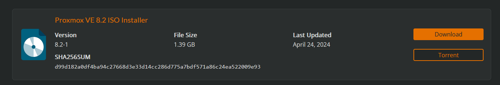
맨 위에 있는 Proxmox V(irtual) E(nvironment) 버전을 다운로드해주세요.

이후 [Rufus](https://rufus.ie), Ventoy 등을 통해 부팅해줍시다.

## Proxmox VE 설치하기
Proxmox VE의 Grub으로 접근해주세요.
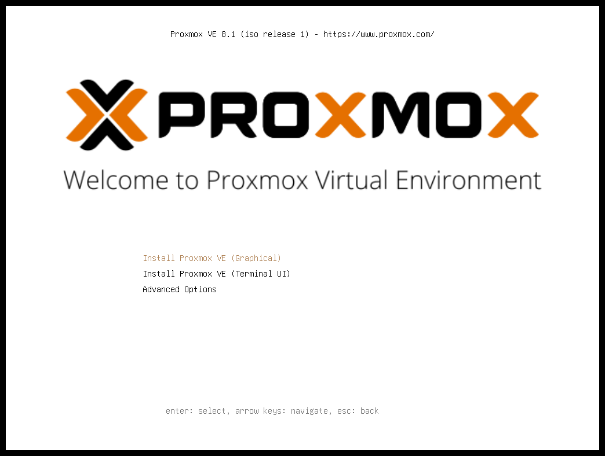
이후 간단하게 설치를 위해 Install Proxmox VE (Graphical)을 선택해주세요.

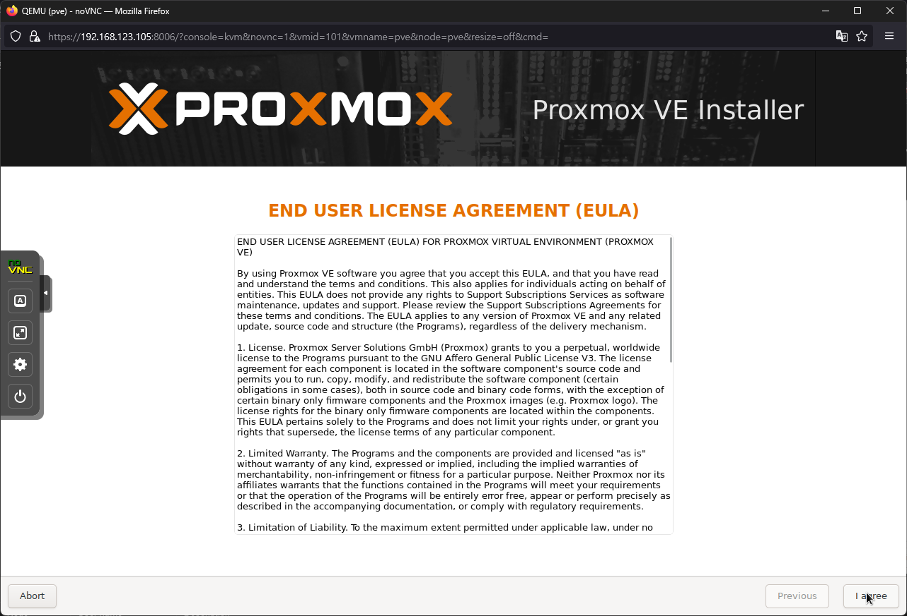
Proxmox의 약관을 동의해주세요.

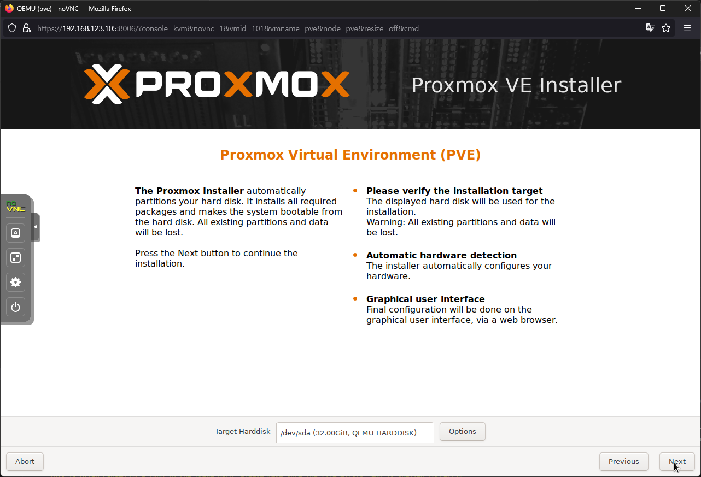
Proxmox에 할당할 디스크를 선택해주세요. 

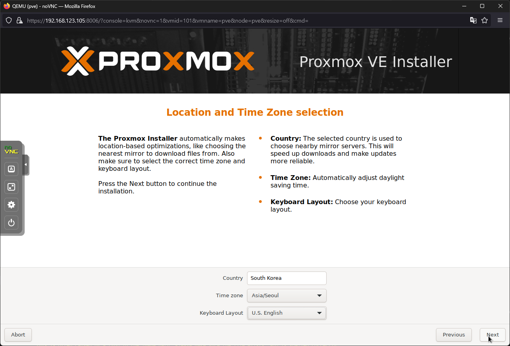
여긴 한국이니 South Korea랑 Asia/Seoul로 시간대를 설정해주세요

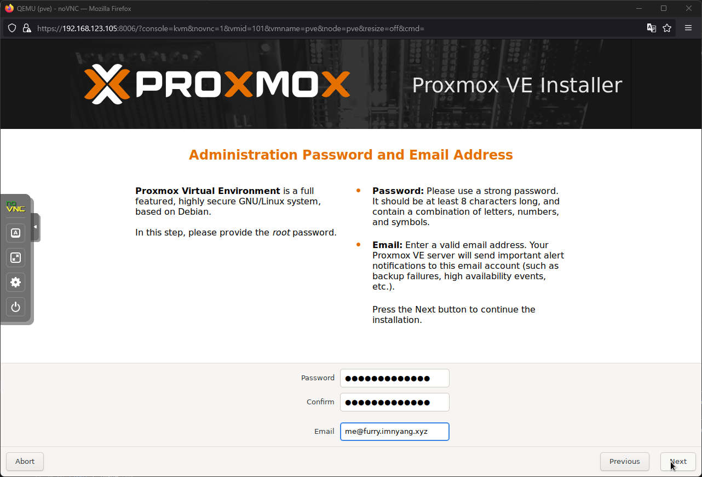
Proxmox에서 비밀번호와 Email을 받을 주소를 적어줍시다.

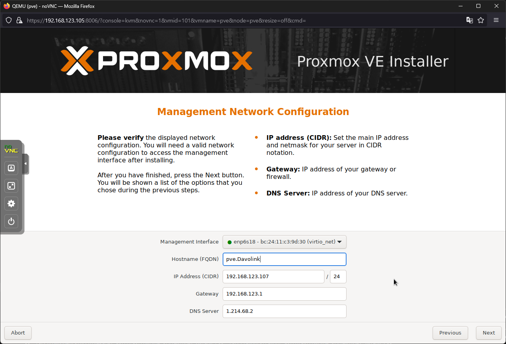
원하는 Hostname을 적어주세요.
IP 주소는 DCHP에서 할당된 이미 설정된 값이나 수동으로 설정해주세요.

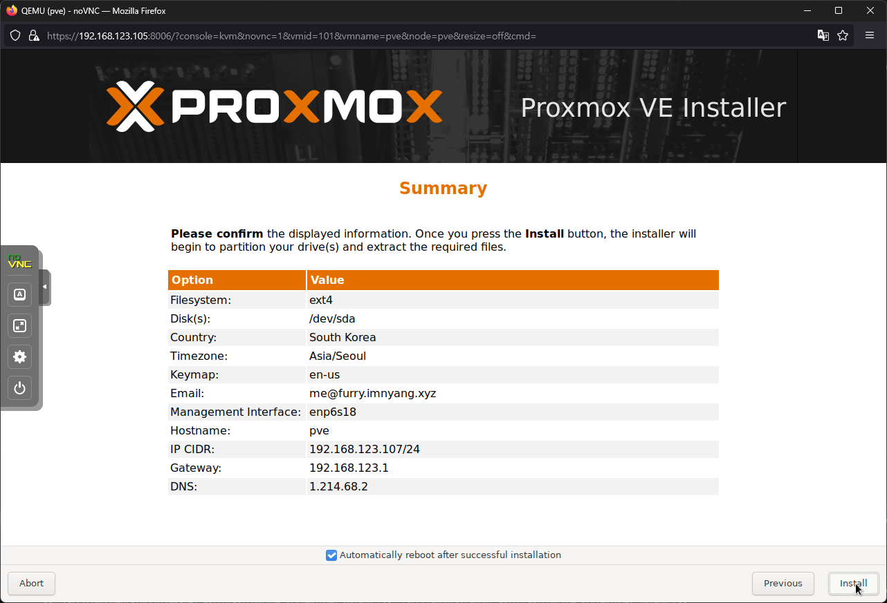
설치를 눌러주세요.

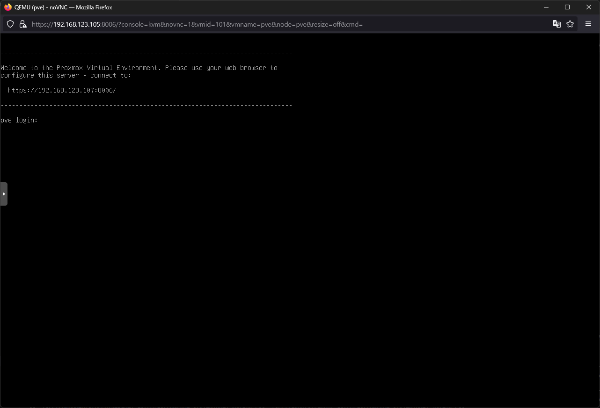

설치를 끝내고 나면 위와 같이 웹 콘솔에 접근 후 세팅을 이어나가라고 합니다.

## Proxmox VE 설정
https://[PVE ip 주소]:8006 으로 접속해주세요.
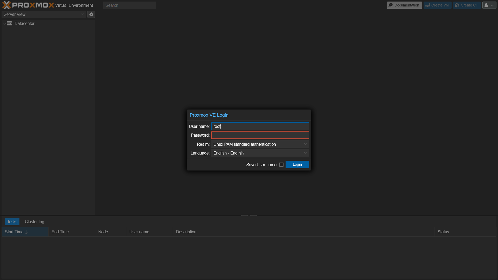

### apt update 문제 해결
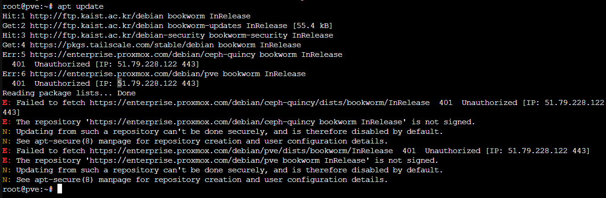
이럴땐 `Datacenter/pve/Update/Repositories`로 들어가주세요

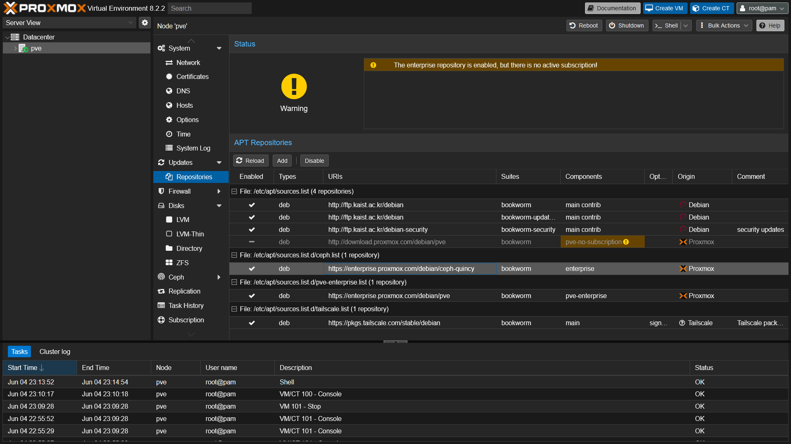
여기선 `/etc/apt/sources.list/ceph.list`와 `/etc/apt/sources.list/pve-enterprise.list`를 비활성화 해주세요.

이후 Add 버튼을 눌러
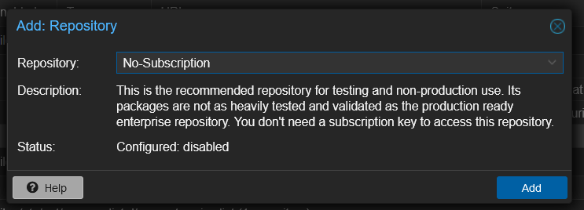

최종적으로 이런 Repositories를 가지게 됩니다.
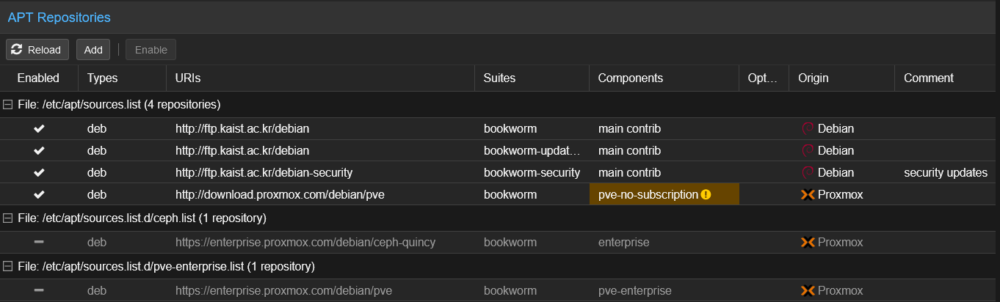

### Local / Local LVM 통합하기

Local과 Local LVM이 나눠져 있을텐데

`Datacenter/pve/Shell`에서 아래와 같이 진행합니다.

```bash
lvremove /dev/pve/data
lvresize -l +100%FREE /dev/pve/root
```

`lvremove` 부분에서 확인을 할텐데요. `y`로 진행하면 됩니다.

```bash
resize2fs -p /dev/pve/root
```

이후 `Datacenter/Storage`에서 local-lvm을 제거합니다.

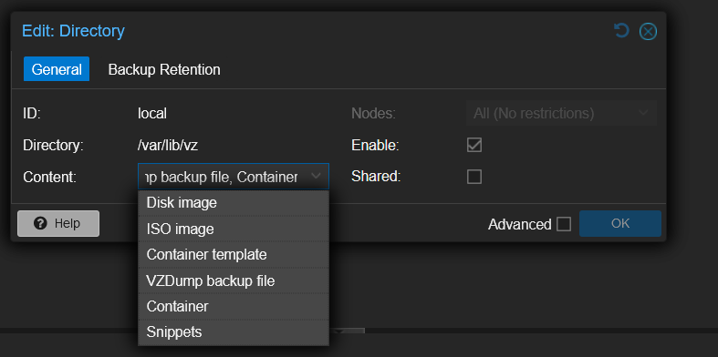
그리고 Local에서 Content를 모두 할당합니다.

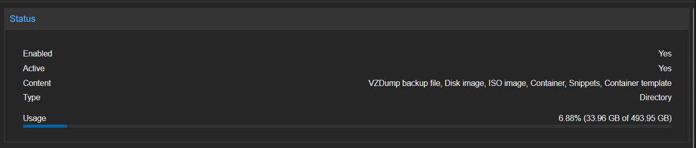
이후 디스크의 할당이 전체로 잡힌 것을 확인할 수 있습니다.

### 로그인시 뜨는 팝업 제거

```bash
curl --proto '=https' --tlsv1.2 -sSf https://raw.githubusercontent.com/rickycodes/pve-no-subscription/main/no-subscription-warning.sh | sh
```
위 스크립트를 실행하면 팝업이 제거됩니다.

```bash
systemctl restart pveproxy.service
```
를 통해 Proxmox 웹 서비스를 다시시작 해 주세요.

## 마치며
이로써 Proxmox의 설치와 기본 설정이 끝났습니다.

이후 VM 생성을 다뤄보도록 하겠습니다.