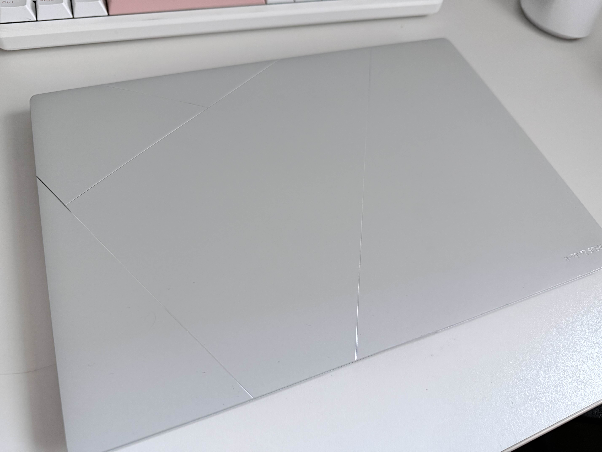

Macbook은 정말 멋진 기기입니다.
제가 원하는 아래의 모든 기능을 갖추고 있죠:

- [x] 이쁜 쓰레기
- [x] 멋진 하드웨어
- [x] 멋진 성능
- [x] 적당한 무게(?)
- [x] 긴 배터리 수명

정말 저에겐 좋은 노트북입니다. 하지만 저희에겐 가장 큰 문제가 있었습니다.

이 미친 소프트웨어는 어떻게 할 방법이 없다는 사실입니다.

# MacOS와 불화
저는 MacOS를 사용해오면서 가장 안정적으로 느꼈던 버전이 MacOS Ventura 이전입니다.
MacOS Ventura 이후에 모든 것들이 나빠졌습니다.

정말 멋진 기능들도 저는 많다고 생각합니다. 패스키와 연속성 카메라는 제가 제일 잘 쓰고 있는 기능들입니다.
MacOS는 이때부터 윈도우와 비슷한 길을 걷고 있다고 생각했습니다.
그렇다고 윈도우보단 나빠질 것같지 않습니다.
문서 폴더와 데스크탑 폴더를 iCloud에 올리는 것 어디서 많이 본 기능같지 않나요?

<small>Source : [개인 파일 공유 및 클라우드 스토리지 | Microsoft OneDrive](https://www.microsoft.com/ko-kr/microsoft-365/onedrive/online-cloud-storage)</small>

정말 끔찍한 악몽을 다시 만난 느낌이 들었습니다.

뭐 여기까진 그렇다고 칩시다.
저런걸 만들어두고 저 기능으론 거진 10년동안 욕을 심하게 쳐먹진 않은 회사도 있으니까요.
뭐 맥에선 저걸 지울수도 없지만 뭐 어쩌겠습니까 그냥 써야죠.

그리고 시간이 지나면서 점점 더 심각한 문제가 발생했습니다.

MacOS Sonoma로 업데이트를 하고 나선 한글 입력기 전환에 큰 딜레이를 얻게되었습니다! 축하드립니다.
뭐 이것도 그렇다고 칩시다. 그리고 잡다한 버그들도 좀 생긴 것같습니다.

하지만 진짜 문제는 따로 있었습니다.
MacOS Tahoe에선 걍 쓰레기가 되었습니다.
모든 리소스를 앱 아이콘의 색 하나 바꾸는데 쓰는 정말 쓰레기같은 운영체제입니다.
이건 iOS 26에서도 발생하는데요. 놀랍게도 앱 아이콘 하나를 바꿨는데 다른 애플리케이션을 사용하는데에서도 큰 프레임 드랍을 느끼는 최악의 사태가 발생하고 있습니다.

그리고 그냥 멋져보이는 UI 요소들을 위해서 UX는 말아먹었나요?
이것이 무슨 아이콘인지 통일성조차도 느껴지지 않습니다.

MacOS는 분명 시대를 역행하고 있는 것이 분명합니다. 이것은 무엇이죠? Windows Aero인가요?

제 맥북이 무엇이였냐고요?
Macbook Air 15" M4였습니다.
정말 멋진 기기였죠. 하지만 MacOS라는 쓰레기를 굴리기 위한 기기였습니다.

# 다른 선택지?

다른 노트북을 저희는 선택해야합니다.
하지만 가장 큰 문제가 있습니다. 바로 맥북만큼 멋진 노트북이 없다는 것입니다.
저는 노트북을 선택할 때 다음과 같은 기준을 가지고 있습니다.

- [x] ~~이쁜 쓰레기~~
- [x] 가벼운 무게
- [x] 14인치대의 화면 크기
- [x] QHD 이상의 해상도
- [x] 32GB 이상의 램
- [x] 외장 글카 없음
- [x] 준수한 배터리 수명

이 기준을 만족하는 노트북은 정말 찾기 힘들었습니다.
하지만 결국 찾긴 했습니다.
바로 ASUS Zenbook S 14 OLED (UX5406S)입니다.

그래서 구매하게 되었습니다.

Windows 11 Home이 들어간 모델인데요.
저는 사실 여기에 뭐가 들어갔든지 모르겠고 NixOS를 바로 설치하였습니다.

정말 멋지게 사용중입니다. Windows Hello가 IR 카메라로 작동하여서 뭐 쓰지도 못하는 쓰레기가 되었지만 뭐 어때요?

제 운영체제는 이제 저에게 뭐라고 할 권리가 없습니다!!!